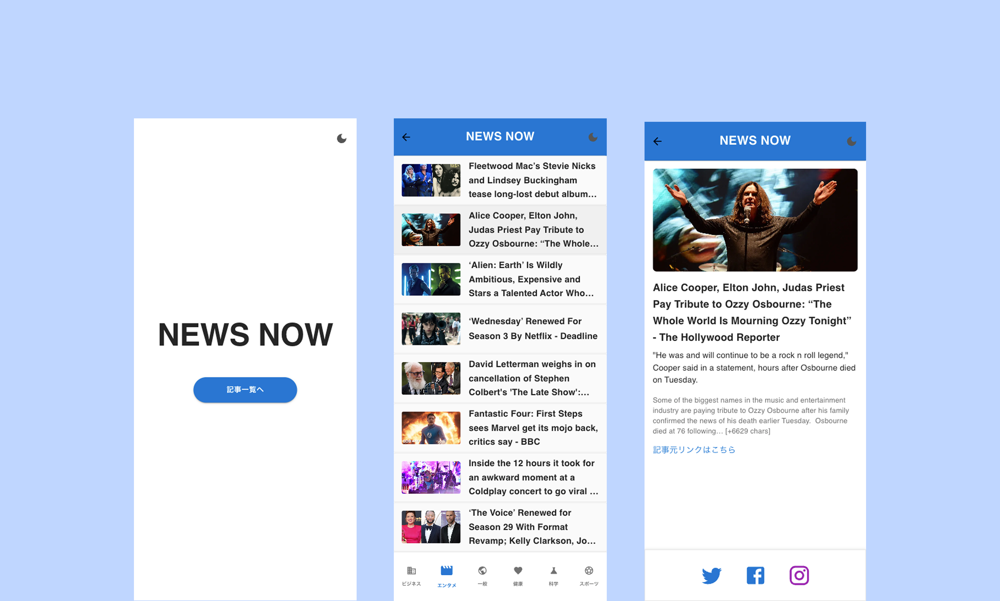

# Next.jsで作成したNewsApp

## 概要
このアプリは、Next.js と TypeScript を使って構築したニュース閲覧アプリです。  
NewsAPI から記事データを取得し、カテゴリーごとの閲覧、詳細表示などが可能です。

## 使用技術
- Next.js (App Router)
- TypeScript
- Material UI（MUI）
- Tailwind CSS（一部使用）
- NewsAPI（外部ニュースAPI）
- Vercel（デプロイ）

## 主な機能
- カテゴリーごとのニュース取得
- 記事の一覧・詳細ページ表示
- ダークモード対応
- BottomNavigation によるカテゴリーナビゲーション
- localStorage を利用した状態保持
- レスポンシブ対応（スマホ・PC）

## APIについて
- [NewsAPI.org](https://newsapi.org/) を使用
- 無料プラン（1日100リクエストまで）を考慮して、必要最低限の取得に最適化

## アプリイメージ

## デプロイ先
[Vercel にて公開中](https://next-news-app-zeta.vercel.app/)

